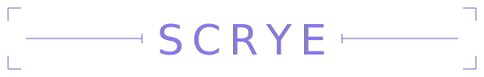

<p align="center">
  
</p>

<p align="center">
  <em>DNS-level network visibility in a single binary. No agents, no cloud, nowhere to hide.</em>
</p>

<p align="center">
  
  <a href="https://github.com/baudsmithstudios/scrye/releases/latest"></a>
  <a href="LICENSE"></a>
  
  
</p>

## What It Does

Scrye is a forwarding DNS server that logs every query, identifies which device made it, and classifies domains against community-maintained tracking lists. It gives you a per-device picture of where your network traffic is going — and how much of it is talking to trackers.

## Features

- **Forwarding DNS server** — drop-in replacement for your router's DNS, forwards to upstream resolvers (Cloudflare, Google, etc.)
- **Per-device attribution** — maps queries to devices via ARP table polling, DHCP snooping, mDNS, and SSDP discovery
- **Domain classification** — matches queries against configurable blocklists (Steven Black, EasyPrivacy, Disconnect.me) with automatic refresh
- **OUI vendor lookup** — identifies device manufacturers from MAC address prefixes
- **Web dashboard** — query volume, tracker percentage, per-device breakdown, domain rankings, all in the browser
- **REST API** — JSON API for devices, queries, domains, lists, settings, and overrides
- **Domain overrides** — manually classify any domain when the lists get it wrong
- **Persistent storage** — SQLite (WAL mode), configurable retention, batched writes
- **Configurable via UI** — retention, list refresh interval, blocklist management all from the settings page

## Quick Start

```sh
git clone https://github.com/baudsmithstudios/scrye.git && cd scrye

# Build and run with Docker
docker compose up -d

# Open the dashboard
open http://localhost:8080
```

Then point your router's DNS to the host running Scrye.

## Configuration

Scrye needs minimal bootstrap config — everything else is managed through the web UI.

```toml
# config.toml
listen    = "0.0.0.0:53"
upstream  = ["1.1.1.1:53", "8.8.8.8:53"]
data_dir  = "/data"
http_port = 8080
```

| Field | Default | Description |
|---|---|---|
| `listen` | `0.0.0.0:53` | DNS listener address |
| `upstream` | `["1.1.1.1:53", "8.8.8.8:53"]` | Upstream DNS resolvers (sequential fallback) |
| `data_dir` | `/data` | SQLite database and data directory |
| `http_port` | `8080` | Web UI and API port |

All fields are optional — Scrye runs with sane defaults if no config file exists.

### Runtime Settings

These are managed through the web UI or API:

| Setting | Default | Description |
|---|---|---|
| `retention_days` | `30` | Days of query history to keep before purging |
| `list_refresh_hours` | `24` | Hours between blocklist refresh cycles |

## Device Discovery

Scrye uses four passive methods to build and maintain a device inventory:

| Method | What It Discovers |
|---|---|
| **ARP table** | IP-to-MAC mapping from `/proc/net/arp` (polled every 30s) |
| **DHCP snooping** | Hostnames from DHCP option 12 in client requests |
| **mDNS** | Hostnames from PTR/SRV records on `224.0.0.251:5353` |
| **SSDP** | Device presence from announcements on `239.255.255.250:1900` |

All discovery is passive — Scrye never sends probes or scans your network.

## Classification

Scrye ships with three default blocklists:

| List | Category |
|---|---|
| [Steven Black Unified](https://raw.githubusercontent.com/StevenBlack/hosts/master/hosts) | tracking |
| [EasyPrivacy](https://v.firebog.net/hosts/Easyprivacy.txt) | analytics |
| [Disconnect.me Tracking](https://s3.amazonaws.com/lists.disconnect.me/simple_tracking.txt) | tracking |

Lists are fetched on first run, cached to SQLite, and refreshed on a configurable interval. Add, remove, or disable lists from the settings page. Custom list URLs must be public `http` or `https` endpoints. Override individual domain classifications when you disagree with a list.

## API

All endpoints return JSON. The API is unauthenticated — bind to localhost or a trusted network.

| Method | Endpoint | Description |
|---|---|---|
| `GET` | `/api/health` | Health check |
| `GET` | `/api/summary` | Dashboard stats (last 24h) |
| `GET` | `/api/devices` | All devices with query stats |
| `GET` | `/api/devices/{mac}` | Single device |
| `PUT` | `/api/devices/{mac}` | Update device label |
| `GET` | `/api/queries` | Query log (filterable by device, domain, time range) |
| `GET` | `/api/domains` | Top domains (last 24h) |
| `GET` | `/api/settings` | Current settings |
| `PUT` | `/api/settings` | Update settings |
| `GET` | `/api/lists` | All classification lists |
| `POST` | `/api/lists` | Add a list |
| `DELETE` | `/api/lists/{id}` | Remove a list |
| `POST` | `/api/lists/refresh` | Trigger immediate list refresh |
| `PUT` | `/api/overrides/{domain}` | Set domain classification override |
| `DELETE` | `/api/overrides/{domain}` | Remove domain override |

### Query Parameters

`GET /api/queries` supports:

| Param | Description |
|---|---|
| `device` | Filter by device MAC |
| `domain` | Filter by domain |
| `from` | Start time (RFC3339) |
| `to` | End time (RFC3339, defaults to now) |
| `limit` | Results per page (default 100) |
| `offset` | Pagination offset |

## Docker Deployment

The compose file uses `network_mode: host` so Scrye can see DNS traffic and the ARP table. Config is bind-mounted read-only.

```sh
docker compose up -d        # start
docker compose logs -f      # logs
docker compose down          # stop
```

The Dockerfile uses a two-stage build: compile in `golang:1.26-alpine`, run in `alpine:3.19` with just the binary and CA certificates.

## Architecture

```
DNS Client
    │
    ▼
DNS Listener (UDP + TCP)
    │
    ├─ Forward to upstream (sequential fallback)
    ├─ Emit QueryRecord to channel
    │
    ▼
Pipeline Writer (async, batched)
    │
    ├─ Resolve IP → MAC via Tracker
    ├─ Classify domain via Manager
    └─ Batch write to SQLite
                                        ↑
Device Tracker (goroutine) ─────────────┘
    ├─ ARP poller (30s)
    ├─ DHCP listener (port 67)
    ├─ mDNS listener (224.0.0.251:5353)
    └─ SSDP listener (239.255.255.250:1900)

Classification Manager (goroutine)
    ├─ Fetch lists on startup
    ├─ Cache to SQLite
    └─ Periodic refresh

Purge Loop (goroutine)
    └─ Delete queries older than retention_days (daily)

Web Server
    ├─ Dashboard, Devices, Domains, Settings pages
    └─ REST API
```

- **DNS Listener** — dual-stack UDP/TCP, forwards to upstream with sequential fallback, emits records non-blocking (drops on channel full rather than blocking DNS)
- **Pipeline Writer** — batches queries (100 per batch or 1s flush), enriches with device MAC and domain category before writing
- **Device Tracker** — passive-only discovery, never probes the network
- **Classification Manager** — atomic pointer swap on refresh, lock-free reads on the hot path
- **SQLite** — WAL mode, `NORMAL` synchronous; schema auto-applied on startup

## Security

- **No blocking** — Scrye observes and classifies but does not block or modify DNS responses
- **No authentication** — the web UI and API are unauthenticated; bind to a trusted network or put behind a reverse proxy
- **No outbound data** — the only outbound connections are DNS forwarding and blocklist fetches
- **Passive discovery** — device identification uses only broadcast/multicast traffic and the local ARP table
- **Parameterized queries** — all SQL uses parameterized statements
- **Input validation** — API endpoints validate and whitelist config keys

## Tech Stack

| Component | Library | Description |
|---|---|---|
| **Language** | [Go](https://github.com/golang/go) | 1.26 |
| **DNS server** | [miekg/dns](https://github.com/miekg/dns) | Full-featured DNS library |
| **Database** | [modernc.org/sqlite](https://gitlab.com/cznic/sqlite) | Pure-Go SQLite driver (CGo-free) |
| **Config parsing** | [BurntSushi/toml](https://github.com/BurntSushi/toml) | TOML configuration file parser |
| **Containerization** | [Docker](https://github.com/moby/moby) | Multi-stage build |
